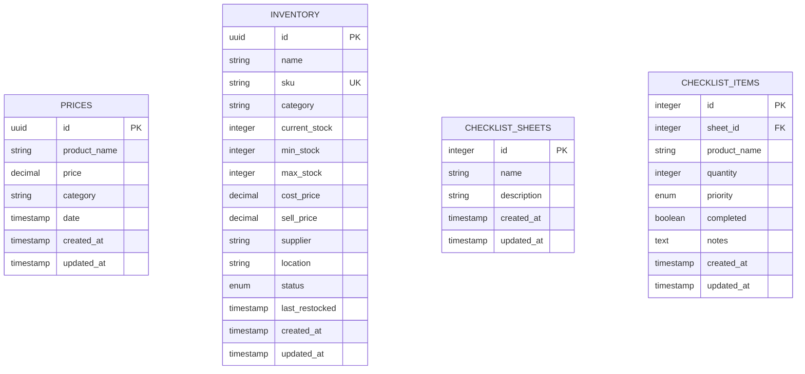

# 🔌 API Documentation - POS Retail Shop

## Table of Contents

- [Overview](#overview)
- [Authentication](#authentication)
- [Base URL](#base-url)
- [Response Format](#response-format)
- [Error Handling](#error-handling)
- [Rate Limiting](#rate-limiting)
- [Endpoints](#endpoints)
  - [Prices API](#prices-api)
  - [Inventory API](#inventory-api)
  - [Checklist API](#checklist-api)
  - [Reports API](#reports-api)
  - [Analytics API](#analytics-api)
- [Database Schema](#database-schema)
- [Webhooks](#webhooks)

---

## Overview

The POS Retail Shop API provides comprehensive endpoints for managing retail operations including inventory, pricing, sales tracking, and reporting. Built on Next.js API routes with Supabase backend.

### Key Features
- **RESTful Design** - Standard HTTP methods and status codes
- **Real-time Updates** - Supabase real-time subscriptions
- **Type Safety** - Full TypeScript support
- **Row Level Security** - Data isolation per user/store
- **Offline Support** - Optimistic updates and sync queues

### Technology Stack
- **Backend**: Next.js API Routes (Serverless)
- **Database**: Supabase (PostgreSQL)
- **ORM**: Prisma
- **Authentication**: Supabase Auth
- **Real-time**: Supabase Realtime
- **Validation**: Zod schemas

---

## Authentication

### API Key Authentication
```http
Authorization: Bearer <your_api_key>
```

### JWT Authentication (Recommended)
```http
Authorization: Bearer <supabase_jwt_token>
```

### Getting API Keys
1. Login to your account
2. Go to Settings → API Keys
3. Generate new API key with appropriate permissions

---

## Base URL

### Development
```
http://localhost:3000/api
```

### Production
```
https://your-store.vercel.app/api
```

---

## Response Format

### Success Response
```json
{
  "success": true,
  "data": {
    // Response data here
  },
  "message": "Operation completed successfully",
  "timestamp": "2024-01-15T10:30:00Z"
}
```

### Error Response
```json
{
  "success": false,
  "error": {
    "code": "VALIDATION_ERROR",
    "message": "Invalid input data",
    "details": {
      "field": "price",
      "issue": "Must be a positive number"
    }
  },
  "timestamp": "2024-01-15T10:30:00Z"
}
```

---

## Error Handling

### HTTP Status Codes

| Code | Meaning | Description |
|------|---------|-------------|
| 200 | OK | Request successful |
| 201 | Created | Resource created |
| 400 | Bad Request | Invalid request data |
| 401 | Unauthorized | Authentication required |
| 403 | Forbidden | Insufficient permissions |
| 404 | Not Found | Resource not found |
| 409 | Conflict | Resource already exists |
| 422 | Unprocessable Entity | Validation error |
| 429 | Too Many Requests | Rate limit exceeded |
| 500 | Internal Server Error | Server error |

### Error Codes

| Code | Description |
|------|-------------|
| `VALIDATION_ERROR` | Input validation failed |
| `NOT_FOUND` | Resource not found |
| `DUPLICATE_ENTRY` | Resource already exists |
| `INSUFFICIENT_STOCK` | Not enough inventory |
| `RATE_LIMIT_EXCEEDED` | Too many requests |
| `DATABASE_ERROR` | Database operation failed |

---

## Rate Limiting

- **Rate Limit**: 100 requests per minute per API key
- **Burst Limit**: 20 requests per 10 seconds
- **Headers**: 
  - `X-RateLimit-Limit`: Request limit
  - `X-RateLimit-Remaining`: Remaining requests
  - `X-RateLimit-Reset`: Reset timestamp

---

## Endpoints

## Prices API

### Get All Prices
```http
GET /api/prices
```

**Parameters:**
- `limit` (optional): Number of records (default: 50, max: 100)
- `offset` (optional): Pagination offset (default: 0)
- `type` (optional): `daily` | `monthly` | `all`
- `category` (optional): Filter by category
- `date_from` (optional): Start date (ISO format)
- `date_to` (optional): End date (ISO format)

**Example:**
```bash
curl -X GET "https://your-store.vercel.app/api/prices?limit=10&type=daily" \
  -H "Authorization: Bearer your_jwt_token"
```

**Response:**
```json
{
  "success": true,
  "data": [
    {
      "id": "uuid-here",
      "product_name": "โค้ก 325ml",
      "price": 15.00,
      "category": "เครื่องดื่ม",
      "date": "2024-01-15T10:30:00Z",
      "created_at": "2024-01-15T10:30:00Z",
      "updated_at": "2024-01-15T10:30:00Z"
    }
  ],
  "pagination": {
    "total": 245,
    "limit": 10,
    "offset": 0,
    "has_more": true
  }
}
```

### Create New Price
```http
POST /api/prices
```

**Request Body:**
```json
{
  "product_name": "มาม่า รสหมูสับ",
  "price": 8.50,
  "category": "อาหารแห้ง",
  "date": "2024-01-15T10:30:00Z"
}
```

**Response:**
```json
{
  "success": true,
  "data": {
    "id": "uuid-here",
    "product_name": "มาม่า รสหมูสับ",
    "price": 8.50,
    "category": "อาหารแห้ง",
    "date": "2024-01-15T10:30:00Z",
    "created_at": "2024-01-15T10:30:00Z"
  },
  "message": "Price created successfully"
}
```

### Update Price
```http
PUT /api/prices/:id
```

**Request Body:**
```json
{
  "product_name": "มาม่า รสหมูสับ",
  "price": 9.00,
  "category": "อาหารแห้ง"
}
```

### Delete Price
```http
DELETE /api/prices/:id
```

**Response:**
```json
{
  "success": true,
  "message": "Price deleted successfully"
}
```

---

## Inventory API

### Get All Inventory Items
```http
GET /api/inventory
```

**Parameters:**
- `limit` (optional): Number of records
- `status` (optional): `in_stock` | `low_stock` | `out_of_stock`
- `category` (optional): Filter by category
- `search` (optional): Search by name or SKU

**Response:**
```json
{
  "success": true,
  "data": [
    {
      "id": "uuid-here",
      "name": "โค้ก 325ml",
      "sku": "COKE325",
      "category": "เครื่องดื่ม",
      "current_stock": 48,
      "min_stock": 20,
      "max_stock": 100,
      "cost_price": 12.00,
      "sell_price": 15.00,
      "supplier": "บริษัท โค้ก",
      "location": "ชั้น A1",
      "status": "in_stock",
      "last_restocked": "2024-01-15T10:30:00Z",
      "created_at": "2024-01-15T10:30:00Z",
      "updated_at": "2024-01-15T10:30:00Z"
    }
  ]
}
```

### Create Inventory Item
```http
POST /api/inventory
```

**Request Body:**
```json
{
  "name": "น้ำดื่ม 600ml",
  "sku": "WATER600",
  "category": "เครื่องดื่ม",
  "current_stock": 50,
  "min_stock": 10,
  "max_stock": 80,
  "cost_price": 3.00,
  "sell_price": 5.00,
  "supplier": "บริษัท น้ำดื่ม",
  "location": "ชั้น A2"
}
```

### Update Stock
```http
PUT /api/inventory/:id/stock
```

**Request Body:**
```json
{
  "quantity": 30,
  "operation": "add" // or "set", "subtract"
}
```

### Get Stock Alerts
```http
GET /api/inventory/alerts
```

**Response:**
```json
{
  "success": true,
  "data": {
    "low_stock": [
      {
        "id": "uuid-here",
        "name": "มาม่า รสหมูสับ",
        "current_stock": 8,
        "min_stock": 15,
        "status": "low_stock"
      }
    ],
    "out_of_stock": [
      {
        "id": "uuid-here",
        "name": "น้ำดื่ม 600ml",
        "current_stock": 0,
        "min_stock": 12,
        "status": "out_of_stock"
      }
    ]
  }
}
```

---

## Checklist API

### Get Checklist Sheets
```http
GET /api/checklist/sheets
```

**Response:**
```json
{
  "success": true,
  "data": [
    {
      "id": 1,
      "name": "รายการซื้อสัปดาห์นี้",
      "description": "สินค้าที่ต้องสั่งซื้อ",
      "created_at": "2024-01-15T10:30:00Z",
      "items_count": 5,
      "completed_count": 2
    }
  ]
}
```

### Get Checklist Items
```http
GET /api/checklist/items?sheetId=1
```

**Response:**
```json
{
  "success": true,
  "data": [
    {
      "id": 1,
      "sheet_id": 1,
      "product_name": "โค้ก 325ml",
      "quantity": 50,
      "priority": "high",
      "completed": false,
      "notes": "เหลือน้อย ต้องสั่งด่วน",
      "created_at": "2024-01-15T10:30:00Z"
    }
  ]
}
```

### Create Checklist Item
```http
POST /api/checklist/items
```

**Request Body:**
```json
{
  "sheet_id": 1,
  "product_name": "มาม่า รสหมูสับ",
  "quantity": 30,
  "priority": "medium",
  "notes": "สำหรับขายสุดสัปดาห์"
}
```

---

## Reports API

### Daily Report
```http
GET /api/reports/daily?date=2024-01-15
```

**Response:**
```json
{
  "success": true,
  "data": {
    "date": "2024-01-15",
    "summary": {
      "total_sales": 1250.00,
      "total_transactions": 48,
      "total_items_sold": 156,
      "average_transaction": 26.04
    },
    "top_products": [
      {
        "product_name": "โค้ก 325ml",
        "quantity_sold": 24,
        "revenue": 360.00
      }
    ],
    "hourly_breakdown": [
      {
        "hour": 9,
        "sales": 125.00,
        "transactions": 5
      }
    ]
  }
}
```

### Monthly Report
```http
GET /api/reports/monthly?year=2024&month=1
```

### Sales Trends
```http
GET /api/reports/trends?period=7d
```

**Parameters:**
- `period`: `7d` | `30d` | `3m` | `1y`

---

## Analytics API

### Dashboard Summary
```http
GET /api/analytics/dashboard
```

**Response:**
```json
{
  "success": true,
  "data": {
    "total_products": 156,
    "total_inventory_value": 23840.00,
    "low_stock_items": 12,
    "out_of_stock_items": 3,
    "daily_sales": {
      "today": 1250.00,
      "yesterday": 1180.00,
      "change_percent": 5.93
    },
    "monthly_sales": {
      "this_month": 35600.00,
      "last_month": 32400.00,
      "change_percent": 9.88
    }
  }
}
```

### Product Performance
```http
GET /api/analytics/products/performance
```

### Sales Forecast
```http
GET /api/analytics/forecast?days=30
```

---

## Database Schema

### Tables Overview



### Table Definitions

#### prices
| Column | Type | Constraints | Description |
|--------|------|-------------|-------------|
| id | UUID | PRIMARY KEY | Unique identifier |
| product_name | VARCHAR(255) | NOT NULL | Product name |
| price | DECIMAL(10,2) | NOT NULL, CHECK (price > 0) | Product price |
| category | VARCHAR(100) | NOT NULL | Product category |
| date | TIMESTAMP | NOT NULL | Price date |
| created_at | TIMESTAMP | DEFAULT NOW() | Creation time |
| updated_at | TIMESTAMP | DEFAULT NOW() | Last update time |

#### inventory
| Column | Type | Constraints | Description |
|--------|------|-------------|-------------|
| id | UUID | PRIMARY KEY | Unique identifier |
| name | VARCHAR(255) | NOT NULL | Product name |
| sku | VARCHAR(50) | UNIQUE, NOT NULL | Stock keeping unit |
| category | VARCHAR(100) | NOT NULL | Product category |
| current_stock | INTEGER | NOT NULL, CHECK (current_stock >= 0) | Current stock level |
| min_stock | INTEGER | NOT NULL, CHECK (min_stock >= 0) | Minimum stock threshold |
| max_stock | INTEGER | NOT NULL, CHECK (max_stock > min_stock) | Maximum stock capacity |
| cost_price | DECIMAL(10,2) | NOT NULL, CHECK (cost_price > 0) | Cost per unit |
| sell_price | DECIMAL(10,2) | NOT NULL, CHECK (sell_price > 0) | Selling price |
| supplier | VARCHAR(255) | | Supplier name |
| location | VARCHAR(100) | | Storage location |
| status | ENUM | ('in_stock', 'low_stock', 'out_of_stock', 'discontinued') | Stock status |
| last_restocked | TIMESTAMP | | Last restock date |
| created_at | TIMESTAMP | DEFAULT NOW() | Creation time |
| updated_at | TIMESTAMP | DEFAULT NOW() | Last update time |

### Indexes

```sql
-- Performance indexes
CREATE INDEX idx_prices_date ON prices(date DESC);
CREATE INDEX idx_prices_category ON prices(category);
CREATE INDEX idx_inventory_sku ON inventory(sku);
CREATE INDEX idx_inventory_status ON inventory(status);
CREATE INDEX idx_inventory_category ON inventory(category);

-- Full-text search
CREATE INDEX idx_inventory_search ON inventory 
USING gin(to_tsvector('english', name || ' ' || sku));
```

### Views

```sql
-- Low stock alerts view
CREATE VIEW low_stock_alerts AS
SELECT 
    id,
    name,
    sku,
    current_stock,
    min_stock,
    (min_stock - current_stock) as shortage,
    CASE 
        WHEN current_stock = 0 THEN 'critical'
        WHEN current_stock <= min_stock * 0.5 THEN 'high'
        ELSE 'medium'
    END as severity
FROM inventory
WHERE current_stock <= min_stock;

-- Daily sales summary view
CREATE VIEW daily_sales_summary AS
SELECT 
    DATE(date) as sales_date,
    COUNT(*) as total_transactions,
    SUM(price) as total_revenue,
    AVG(price) as average_price,
    COUNT(DISTINCT category) as categories_sold
FROM prices
GROUP BY DATE(date)
ORDER BY sales_date DESC;
```

---

## Webhooks

### Setup Webhooks
```http
POST /api/webhooks/setup
```

**Request Body:**
```json
{
  "url": "https://your-app.com/webhook",
  "events": ["inventory.low_stock", "sales.daily_summary"],
  "secret": "your_webhook_secret"
}
```

### Webhook Events

#### inventory.low_stock
Triggered when stock falls below minimum threshold.

**Payload:**
```json
{
  "event": "inventory.low_stock",
  "data": {
    "item_id": "uuid-here",
    "name": "มาม่า รสหมูสับ",
    "current_stock": 8,
    "min_stock": 15,
    "shortage": 7
  },
  "timestamp": "2024-01-15T10:30:00Z"
}
```

#### sales.daily_summary  
Triggered at end of each day.

**Payload:**
```json
{
  "event": "sales.daily_summary",
  "data": {
    "date": "2024-01-15",
    "total_sales": 1250.00,
    "total_transactions": 48,
    "top_product": "โค้ก 325ml"
  },
  "timestamp": "2024-01-16T00:01:00Z"
}
```

### Webhook Security

Verify webhook signatures using HMAC SHA-256:

```javascript
const crypto = require('crypto');

function verifyWebhook(payload, signature, secret) {
    const expectedSignature = crypto
        .createHmac('sha256', secret)
        .update(payload)
        .digest('hex');
    
    return signature === `sha256=${expectedSignature}`;
}
```

---

## Rate Limits

### API Rate Limits

| Endpoint | Rate Limit | Window |
|----------|------------|--------|
| GET endpoints | 100/min | 1 minute |
| POST/PUT endpoints | 50/min | 1 minute |
| DELETE endpoints | 20/min | 1 minute |
| Reports | 10/min | 1 minute |
| Webhooks | 5/min | 1 minute |

### Handling Rate Limits

When rate limited, API returns:
```json
{
  "success": false,
  "error": {
    "code": "RATE_LIMIT_EXCEEDED",
    "message": "Too many requests",
    "retry_after": 60
  }
}
```

**Recommended handling:**
```javascript
async function apiCallWithRetry(url, options, maxRetries = 3) {
    for (let i = 0; i < maxRetries; i++) {
        const response = await fetch(url, options);
        
        if (response.status === 429) {
            const retryAfter = response.headers.get('Retry-After') || 60;
            await new Promise(resolve => setTimeout(resolve, retryAfter * 1000));
            continue;
        }
        
        return response;
    }
    
    throw new Error('Max retries exceeded');
}
```

---

## SDK Examples

### JavaScript/Node.js
```javascript
const PosAPI = require('@your-store/pos-sdk');

const client = new PosAPI({
    baseURL: 'https://your-store.vercel.app/api',
    apiKey: 'your_api_key'
});

// Get prices
const prices = await client.prices.list({ limit: 10 });

// Create inventory item  
const item = await client.inventory.create({
    name: 'น้ำดื่ม 600ml',
    sku: 'WATER600',
    current_stock: 50,
    min_stock: 10,
    cost_price: 3.00,
    sell_price: 5.00
});

// Get daily report
const report = await client.reports.daily('2024-01-15');
```

### Python
```python
from pos_api import PosClient

client = PosClient(
    base_url='https://your-store.vercel.app/api',
    api_key='your_api_key'
)

# Get inventory with low stock
low_stock = client.inventory.get_alerts()

# Create checklist item
item = client.checklist.create_item(
    sheet_id=1,
    product_name='โค้ก 325ml',
    quantity=50,
    priority='high'
)
```

---

## Testing

### Test Environment
```
Base URL: https://test.your-store.vercel.app/api
```

### Test Data
The test environment includes sample data:
- 50 products with various stock levels
- 30 days of price history
- Sample checklist sheets and items

### Postman Collection
Import our Postman collection for easy testing:
```
https://your-store.com/postman/pos-api-collection.json
```

---

## Support

### Documentation
- 📖 **API Docs**: https://docs.your-store.com/api
- 🔧 **SDK Docs**: https://docs.your-store.com/sdk
- 📝 **Guides**: https://docs.your-store.com/guides

### Contact
- 📧 **Email**: api-support@your-store.com
- 💬 **Discord**: https://discord.gg/your-store-dev  
- 🐛 **Issues**: https://github.com/your-store/pos-api/issues

### Service Status
- 📊 **Status Page**: https://status.your-store.com
- 📈 **Uptime**: 99.9% SLA
- 🔔 **Incidents**: Subscribe to status updates

---

<div align="center">

**Built with ❤️ for Thai Shop Owners**

[⭐ Star our API on GitHub](https://github.com/your-store/pos-api) | [📚 More Docs](https://docs.your-store.com) | [💬 Join Community](https://discord.gg/your-store)

</div>